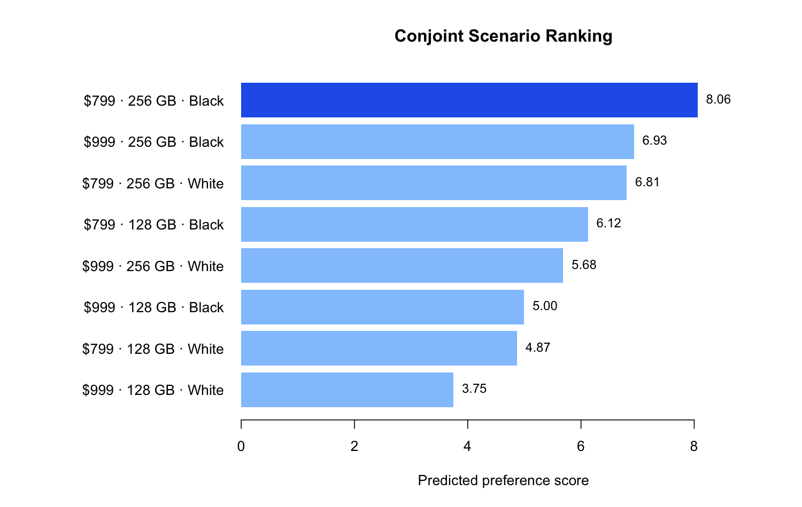

# iPhone Conjoint Product Design

I used aggregate part-worth utilities to compare product trade-offs across price, storage, and color and identify the highest-scoring iPhone concept within the tested design space.

This project was completed with Bhavisha Chafekar, Omkar Thombare, Parul Chaudhary, and Shivanshu Dagur. This public repository contains my reproducible scenario-analysis layer and aggregate model estimates only; it excludes respondent-level survey data, submissions, and course materials.

## Decision question

Which combination of price, storage, and color produces the strongest predicted preference among the eight tested profiles?

## Tested design

| Attribute | Levels |
|---|---|
| Price | $799, $999 |
| Storage | 128 GB, 256 GB |
| Color | Black, White |

## Aggregate part-worth results

- Moving from **$799 to $999** reduced preference by **1.125 points**.
- Moving from **128 GB to 256 GB** increased preference by **1.9375 points**.
- Moving from **Black to White** reduced preference by **1.25 points**.

## Recommendation

The highest-scoring tested profile was:

> **$799 · 256 GB · Black — predicted preference: 8.06**

Storage created the largest positive change in the tested model, while the higher price and White color each reduced predicted preference.



## Run

```bash
Rscript R/rank_profiles.R
Rscript tests/test_analysis.R
```

The analysis enumerates all eight combinations and writes the ranked profiles and visualization to `outputs/`.

## Interpretation boundary

These scores describe relative stated preference within a small, fixed set of levels. They do not estimate market demand, price elasticity, brand value, or willingness to pay. Brand was held constant, and respondent-level data are intentionally not published.
